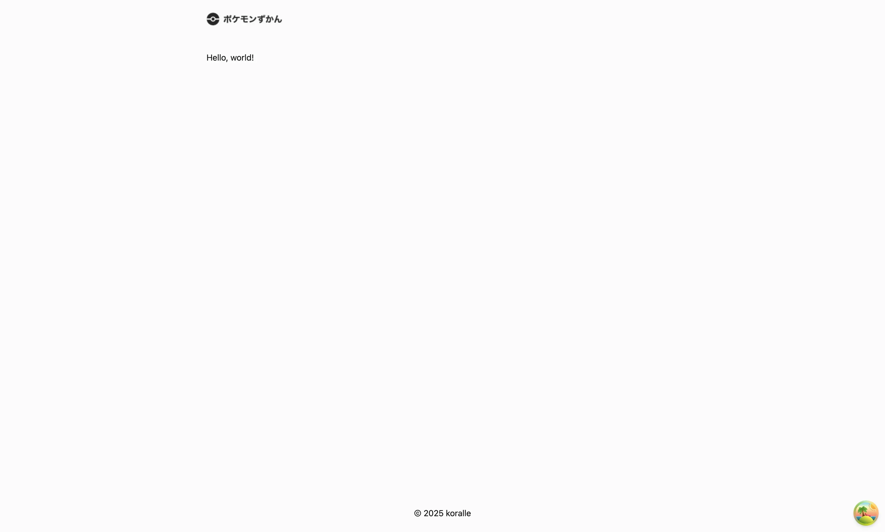

# Chapter 2 共通レイアウト

## このChapterでやること

2.1. 共通レイアウトの作成
2.2. レイアウトをアプリケーションに組み込む

## 2.1. 共通レイアウトの作成

ヘッダー（Header）やフッター（Footer）をはじめとする共通レイアウトを作成します。

[`src/components/layout.tsx`](https://github.com/koralle/geek-project-pokemon-app/blob/chapter_02/implement-global-layout/src/components/layout.tsx) を作成し、以下のコードを追加してください。

<details>
  <summary>コードを見る（長いので省略）</summary>

```diff
+ import { Box, Center, Grid, HStack, Image, Spacer, Text } from '@yamada-ui/react'
+ import { memo } from 'react'
+ import type { ReactNode } from 'react'
+ 
+ const Wrapper = ({ children }: { children: ReactNode }) => (
+   <Box
+     maxW={960}
+     minW={320}
+     w="100%"
+     px={{ base: 4, md: 8 }}
+     py={6}
+     h="100%"
+   >
+     {children}
+   </Box>
+ )
+ 
+ const Header = () => {
+   return (
+     <Center
+       as="header"
+       backdropBlur="0.5rem"
+       backdropFilter="auto"
+       backdropSaturate="180%"
+       position="sticky"
+       top={0}
+       left={0}
+       right={0}
+       zIndex={1}
+     >
+       <Wrapper>
+         <HStack>
+           <Image
+             src="title.png"
+             alt="ポケモンずかん"
+             decoding="auto"
+           />
+           <Spacer />
+         </HStack>
+       </Wrapper>
+     </Center>
+   )
+ }
+ 
+ const Main = ({ children }: { children: ReactNode }) => (
+   <Center
+     as="main"
+     id="main"
+     minH="100%"
+   >
+     <Wrapper>{children}</Wrapper>
+   </Center>
+ )
+ 
+ const Footer = memo(() => (
+   <Center as="footer">
+     <Wrapper>
+       <Center>
+         <Text>&copy; 2025 koralle</Text>
+       </Center>
+     </Wrapper>
+   </Center>
+ ))
+ 
+ export const Layout = ({ children }: { children: ReactNode }) => (
+   <Grid
+     minW="100svi"
+     minH="100svb"
+     templateRows="max-content 1fr max-content"
+     gap={0}
+   >
+     <Header />
+     <Main>{children}</Main>
+     <Footer />
+   </Grid>
+ )
```

</details>


## 2.2. レイアウトをアプリケーションに組み込む

前節で作成した共通レイアウトをアプリケーションに組み込みます。

[`src/main.tsx`](https://github.com/koralle/geek-project-pokemon-app/blob/chapter_02/implement-global-layout/src/main.tsx) を開き、以下のコードを追加してください。

```diff
  import { QueryClientProvider } from '@tanstack/react-query'
  import { ReactQueryDevtools } from '@tanstack/react-query-devtools'
  import { UIProvider } from '@yamada-ui/react'
  import { StrictMode } from 'react'
  import { createRoot } from 'react-dom/client'
  import { App } from './app'
+ import { Layout } from './components/layout'
  import { queryClient } from './lib/query-client'
  import { customConfig } from './styles/config'
  
  // biome-ignore lint/style/noNonNullAssertion:
  createRoot(document.getElementById('root')!).render(
    <StrictMode>
      <QueryClientProvider client={queryClient}>
        <UIProvider config={customConfig}>
+         <Layout>
            <App />
+         </Layout>
        </UIProvider>
        <ReactQueryDevtools initialIsOpen={false} />
      </QueryClientProvider>
    </StrictMode>,
  )
```

### Checkpoint


