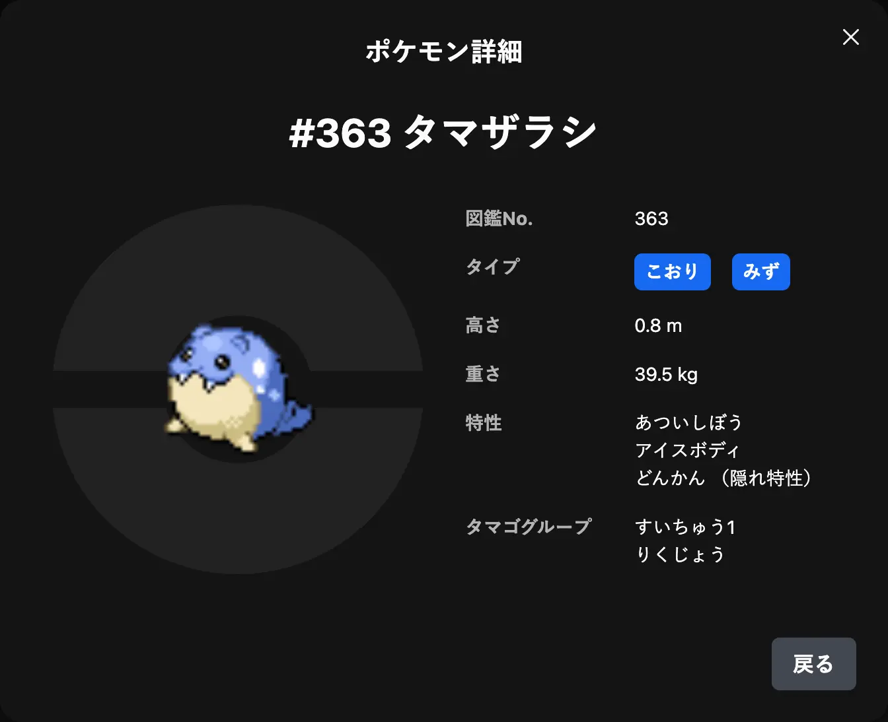
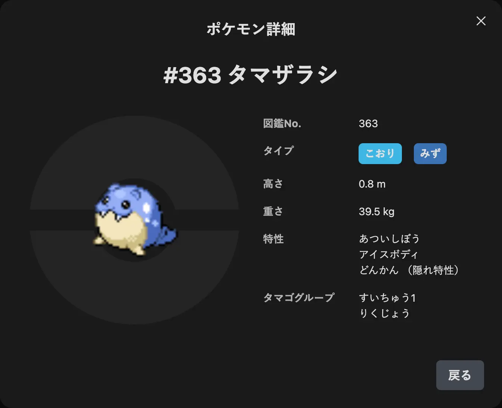

# Chapter 5 - デザインの改善

## このChapterでやること

1. アプリケーションにカラーモードを導入する
2. カードUIに動きをつける
3. Yamada UIのテーマをカスタマイズする

## 5.1. アプリケーションにカラーモードを導入する

### 5.1.1. Viteの設定を変更する

Viteの設定を変更するだけでカラーモードの設定をすることができます。実際にやってみましょう。

[`vite.config.ts`](https://github.com/koralle/geek-project-pokemon-app/blob/chapter_05/implement-design-improvement/vite.config.ts) を開き、以下のようにコードを編集します。

```diff
  import react from '@vitejs/plugin-react-swc'
- import { defineConfig } from 'vite'
+ import { getColorModeScript } from '@yamada-ui/react'
+ import { defineConfig, Plugin } from 'vite'
+ import { customConfig } from './src/styles/config'
+
+ const injectScript = (): Plugin => {
+   return {
+     name: 'vite-plugin-inject-scripts',
+     transformIndexHtml(html, _) {
+       const content = getColorModeScript({
+         initialColorMode: customConfig.initialColorMode ?? 'system',
+       })
+       return html.replace("<body>", `<body><script>${content}</script>`)
+     },
+   }
+ }
  
  // https://vite.dev/config/
  export default defineConfig({
-   plugins: [react()],
+   plugins: [react(), injectScript()],
  })
```

> [!CAUTION]
> `tsconfig.node.json` に以下の変更も入れておきましょう。
> これがなくても最低限アプリケーションは動くのですが、プロジェクト設定としては必要です。
>
> ```diff
> - "include": ["vite.config.ts"]
> + "include": ["vite.config.ts", "src/styles/config.ts"]
> ```

### 5.1.2. カラーモードを切り替えるためのUIを実装する

カラーモードはただ導入するだけではあまり意味はありません。  
ユーザーが自分の好みのカラーモードに切り替えられるように、UIを実装しましょう。

[`src/components/layout/layout.tsx`](https://github.com/koralle/geek-project-pokemon-app/blob/chapter_05/implement-design-improvement/src/components/layout/layout.tsx) を開き、以下のようにコードを編集します。

<details>
<summary>コードを見る（長いので省略）</summary>

```diff
- import { Box, Center, Grid, HStack, Image, Spacer, Text } from '@yamada-ui/react'
+ import { MoonIcon, SunIcon } from '@yamada-ui/lucide'
+ import { Box, Center, Grid, HStack, IconButton, Image, Spacer, Text, useColorMode } from '@yamada-ui/react'
  import { memo } from 'react'
  import type { ReactNode } from 'react'
  
  const Wrapper = ({ children }: { children: ReactNode }) => (
    <Box
      maxW={960}
      minW={320}
      w="100%"
      px={{ base: 4, md: 8 }}
      py={6}
      h="100%"
    >
      {children}
    </Box>
  )
  
+ const ToggleColorModeButton = () => {
+   const { colorMode, toggleColorMode } = useColorMode()
+ 
+   return (
+     <IconButton
+       icon={colorMode === 'dark' ? <SunIcon fontSize={6} /> : <MoonIcon fontSize={6} />}
+       variant="primary"
+       fullRounded
+       onClick={toggleColorMode}
+     />
+   )
+ }

  const Header = () => {
+   const { colorMode } = useColorMode()
+ 
    return (
      <Center
        as="header"
        backdropBlur="0.5rem"
        backdropFilter="auto"
        backdropSaturate="180%"
        position="sticky"
        top={0}
        left={0}
        right={0}
        zIndex={1}
      >
        <Wrapper>
          <HStack>
-           <Image
-             src="title.png"
-             alt="ポケモンずかん"
-             decoding="auto"
-           />
+           {colorMode === 'light' ? (
+             <Image
+               src="title.png"
+               alt="ポケモンずかん"
+               decoding="auto"
+               fetchPriority="high"
+             />
+           ) : (
+             <Image
+               src="title-dark.png"
+               alt="ポケモンずかん"
+               decoding="auto"
+               fetchPriority="high"
+             />
+           )}
            <Spacer />
+           <ToggleColorModeButton />
          </HStack>
        </Wrapper>
      </Center>
    )
  }
```
</details>

### Checkpoint

<video src="./videos/chapter_05/toggle-color-mode.webm" width="600" controls></video>

## 5.2. カードUIに動きをつける

### 5.2.1. マウスホバーした時のカードの動きを実装する

ポケモンが表示されているカードにホバーした時にカードが少しふわっとするアニメーションを入れてみます。  
Yamada UIのMotionを使えば、このアニメーションも簡単に実装することができます。

[`src/components/list/card.tsx`](https://github.com/koralle/geek-project-pokemon-app/blob/chapter_05/implement-design-improvement/src/components/list/card.tsx) を開き、以下のようにコードを編集します。

<details>
<summary>コードを見る（長いので省略）</summary>

```diff
- import { Card, CardBody, CardHeader, Center, Image, Skeleton, Text, VStack, useDisclosure } from '@yamada-ui/react'
+ import {
+   Card,
+   CardBody,
+   CardHeader,
+   Center,
+   Image,
+   Motion,
+   Skeleton,
+   Text,
+   VStack,
+   useDisclosure,
+ } from '@yamada-ui/react'
  import { memo, useId } from 'react'
  import type { PokemonSpeciesId } from '../../entities'
  import { usePokemon } from '../../hooks/use-pokemon'

    // ...
  
    return (
      <>
-       <Card
-         as="button"
-         onClick={onOpen}
-         rounded="2xl"
-         aria-labelledby={cardLabelId}
-         w="100%"
-       >
-         <CardHeader w="100%">
-           <Text
-             fontWeight="bold"
-             textAlign="start"
-           >
-             #{nationalPokedexNumber}
-           </Text>
-         </CardHeader>
-         <CardBody
-           as={VStack}
-           alignItems="center"
-           gap={6}
-           paddingBlockStart={6}
+       <Motion whileHover={{ scale: 1.05, translateY: -8 }}>
+         <Card
+           as="button"
+           onClick={onOpen}
+           rounded="2xl"
+           aria-labelledby={cardLabelId}
+           w="100%"
          >
-            <Center>
-              <BackgroundImage />
-              {imageSrc ? (
-                <Image
-                  position="absolute"
-                  src={imageSrc}
-                  alt={name}
-                  decoding="auto"
-                  w={{ base: 120, md: 160 }}
-                  h={{ base: 120, md: 160 }}
-                />
-              ) : (
-                <Text
-                  fontSize={{ base: 'lg', md: 'md' }}
-                  textAlign="center"
-                  fontWeight="bold"
-                  position="absolute"
-                >
-                  Not Found
-                </Text>
-              )}
-            </Center>
-            <Text
-              id={cardLabelId}
-              textAlign="center"
-              fontWeight="bold"
+            <CardHeader w="100%">
+              <Text
+                fontWeight="bold"
+                textAlign="start"
+              >
+                #{nationalPokedexNumber}
+              </Text>
+            </CardHeader>
+            <CardBody
+              as={VStack}
+              alignItems="center"
+              gap={6}
+              paddingBlockStart={6}
             >
-              {name}
-            </Text>
-          </CardBody>
-        </Card>
+             <Center>
+               <BackgroundImage />
+               {imageSrc ? (
+                 <Image
+                   position="absolute"
+                   src={imageSrc}
+                   alt={name}
+                   decoding="auto"
+                   w={{ base: 120, md: 160 }}
+                   h={{ base: 120, md: 160 }}
+                 />
+               ) : (
+                 <Text
+                   fontSize={{ base: 'lg', md: 'md' }}
+                   textAlign="center"
+                   fontWeight="bold"
+                   position="absolute"
+                 >
+                   Not Found
+                 </Text>
+               )}
+             </Center>
+             <Text
+               id={cardLabelId}
+               textAlign="center"
+               fontWeight="bold"
+             >
+               {name}
+             </Text>
+           </CardBody>
+         </Card>
+       </Motion>
        <PokemonModalDialog
          open={open}
          onClose={onClose}
```
</details>

### 5.2.2. マウスクリック/タップした時のカードの動きを実装する

マウスクリック/タップした時に、波紋が広がるようなアニメーション（Ripple）を実装してみます。  
これは Yamada UI の Ripple / useRipple を使えば簡単に実装できます。

[`src/components/list/card.tsx`](https://github.com/koralle/geek-project-pokemon-app/blob/chapter_05/implement-design-improvement/src/components/list/card.tsx) を開き、以下のようにコードを編集します。

<details>
<summary>コードを見る（長いので省略）</summary>

```diff
    Center,
    Image,
    Motion,
+   Ripple,
    Skeleton,
    Text,
    VStack,
    useDisclosure,
+   useRipple,
  } from '@yamada-ui/react'
  import { memo, useId } from 'react'
  import type { PokemonSpeciesId } from '../../entities'
  // ...
    const { name, nationalPokedexNumber, imageSrc } = data
  
    const { open, onOpen, onClose } = useDisclosure()
+   const { onPointerDown, ripples, onClear } = useRipple()
  
    const cardLabelId = useId()
  
    // ...
            as="button"
            onClick={onOpen}
            rounded="2xl"
+           onPointerDown={onPointerDown}
+           position="relative"
+           overflow="hidden"
            aria-labelledby={cardLabelId}
            w="100%"
          >
                {/* ... */}
                {name}
              </Text>
            </CardBody>
+           <Ripple
+             ripples={ripples}
+             onClear={onClear}
+           />
          </Card>
        </Motion>
        <PokemonModalDialog
```
</details>

#### Checkpoint

マウスクリック/タップした時に波紋が広がるアニメーションがあるので、ユーザーが操作を正しく完了できたのかが分かりやすくなりました。

<video src="./videos/chapter_05/ripple-animation.webm" width="600" controls></video>

## 5.3. Yamada UIのテーマをカスタマイズする

### 5.3.1. カスタムテーマの設定を導入する

カスタムテーマはYamada UIの重要な機能の一つです。

まずは [src/styles/index.ts](https://github.com/koralle/geek-project-pokemon-app/blob/chapter_05/implement-design-improvement/src/styles/index.ts) を開き、以下のようにコードを編集します。

```diff
+ import { extendTheme } from '@yamada-ui/react'
+ import type { UsageTheme } from '@yamada-ui/react'
+ const customTheme: UsageTheme = {}
+ export const theme = extendTheme(customTheme)()
```

まずは [src/main.tsx](https://github.com/koralle/geek-project-pokemon-app/blob/chapter_05/implement-design-improvement/src/main.tsx) を開き、以下のようにコードを編集します。

```diff
  import { App } from './app'
  import { Layout } from './components/layout'
  import { queryClient } from './lib/query-client'
+ import { theme } from './styles'
  import { customConfig } from './styles/config'
  
  // biome-ignore lint/style/noNonNullAssertion:
  createRoot(document.getElementById('root')!).render(
    <StrictMode>
      <QueryClientProvider client={queryClient}>
-       <UIProvider config={customConfig}>
+       <UIProvider
+         theme={theme}
+         config={customConfig}
+       >
          <Layout>
            <App />
          </Layout>
```


### 5.3.2. Breakpointをカスタマイズする

今回のアプリケーションのUIデザインの都合上、Breakpointを変更すると都合が良いです。

まずは [src/styles/breakpoints.ts](https://github.com/koralle/geek-project-pokemon-app/blob/chapter_05/implement-design-improvement/src/styles/breakpoints.ts) を開き、以下のコードを追加します。

```diff
+ import type { UsageTheme } from '@yamada-ui/react'
+ export const breakpoints: NonNullable<UsageTheme['breakpoints']> = {
+   xs: '375px',
+   sm: '480px',
+   md: '768px',
+   lg: '960px',
+   xl: '1200px',
+   '2xl': '1440px',
+   '3xl': '1536px',
+ }
```

次に [src/styles/index.ts](https://github.com/koralle/geek-project-pokemon-app/blob/chapter_05/implement-design-improvement/src/styles/index.ts) を開き、以下のようにコードを編集します。

```diff
  import { extendTheme } from '@yamada-ui/react'
  import type { UsageTheme } from '@yamada-ui/react'
+ import { breakpoints } from './breakpoints'
  
- const customTheme: UsageTheme = {}
+ const customTheme: UsageTheme = {
+   breakpoints,
+ }
  
- export const theme = extendTheme(customTheme)()
+ export const theme = extendTheme(customTheme)({ omit: ['breakpoints'] })
```

### 5.3.3. プライマリカラーを変更する

プライマリカラーは、そのアプリケーションにおいて最も重要なカラーです。  
今回はプライマリカラーをポケモン図鑑っぽい赤い色に変更してみます。その結果、ページネーションのボタンの色が青から赤に変更されます。

まずは [src/styles/tokens/colors.ts](https://github.com/koralle/geek-project-pokemon-app/blob/chapter_05/implement-design-improvement/src/styles/tokens/colors.ts) を開き、以下のコードを追加します。

```diff
+ import { generate } from '@yamada-ui/react'
+ import type { ThemeTokens } from '@yamada-ui/react'
+
+ export const colors: ThemeTokens = {
+   pokedex: generate.tones('#b94646'),
+   pokedexDark: generate.tones('#c56767'),
+ }
```

次に [src/styles/tokens/index.ts](https://github.com/koralle/geek-project-pokemon-app/blob/chapter_05/implement-design-improvement/src/styles/tokens/index.ts) を開き、以下のようにコードを編集します。

```diff
import { colors } from './colors'

export const tokens = { colors }
```

最後に [src/styles/index.ts](https://github.com/koralle/geek-project-pokemon-app/blob/chapter_05/implement-design-improvement/src/styles/index.ts) を開き、以下のようにコードを編集します。

```diff
  import { extendTheme } from '@yamada-ui/react'
  import type { UsageTheme } from '@yamada-ui/react'
  import { breakpoints } from './breakpoints'
+ import { tokens } from './tokens'
  
  const customTheme: UsageTheme = {
    breakpoints,
+   ...tokens,
  }
  
  export const theme = extendTheme(customTheme)({ omit: ['breakpoints'] })
```

#### Checkpoint

##### Before

プライマリカラーを設定する前のページネーションでは、ページネーションのボタンが青色で表示されていま。


##### After

プライマリカラーを設定した後のページネーションでは、ページネーションのボタンが新しく設定したプライマリーカラーで表示されるようになりました。


### 5.3.4. ポケモンのタイプごとのカラーを設定する

まずは [src/styles/tokens/colors.ts](https://github.com/koralle/geek-project-pokemon-app/blob/chapter_05/implement-design-improvement/src/styles/tokens/colors.ts) を開き、以下のコードを追加します。

```diff
  export const colors: ThemeTokens = {
    pokedex: generate.tones('#b94646'),
    pokedexDark: generate.tones('#c56767'),
+   pokemonType: {
+     normal: generate.tones('#949495'),
+     fire: generate.tones('#e56c3e'),
+     water: generate.tones('#5185c5'),
+     grass: generate.tones('#66a945'),
+     electric: generate.tones('#f6d851'),
+     ice: generate.tones('#6dc8eb'),
+     fighting: generate.tones('#e09c40'),
+     poison: generate.tones('#735198'),
+     ground: generate.tones('#9c7743'),
+     flying: generate.tones('#a2c3e7'),
+     psychic: generate.tones('#dd6b7b'),
+     bug: generate.tones('#9fa244'),
+     rock: generate.tones('#bfb889'),
+     ghost: generate.tones('#684870'),
+     dragon: generate.tones('#535ca8'),
+     dark: generate.tones('#4c4948'),
+     steel: generate.tones('#69a9c7'),
+     fairy: generate.tones('#dab4d4'),
+   },
  }
```

次に、[src/styles/semantics.ts](https://github.com/koralle/geek-project-pokemon-app/blob/chapter_05/implement-design-improvement/src/styles/semantics.ts) を開き、以下のようにコードを編集します。

```diff
  import type { ThemeSemantics } from '@yamada-ui/react'
  
  export const semantics: ThemeSemantics = {
    colors: {
      black: ['#262626', '#1a1a1a'],
      white: ['#fcfcfc', '#e0e0e0'],
    },
    colorSchemes: {
      primary: ['pokedex', 'pokedexDark'],
+     normal: 'pokemonType.normal',
+     fire: 'pokemonType.fire',
+     water: 'pokemonType.water',
+     electric: 'pokemonType.electric',
+     grass: 'pokemonType.grass',
+     ice: 'pokemonType.ice',
+     fighting: 'pokemonType.fighting',
+     poison: 'pokemonType.poison',
+     ground: 'pokemonType.ground',
+     flying: 'pokemonType.flying',
+     psychic: 'pokemonType.psychic',
+     bug: 'pokemonType.bug',
+     rock: 'pokemonType.rock',
+     ghost: 'pokemonType.ghost',
+     dragon: 'pokemonType.dragon',
+     dark: 'pokemonType.dark',
+     steel: 'pokemonType.steel',
+     fairy: 'pokemonType.fairy',
    },
  }
```

#### Before

「こおり」タイプも「みず」タイプも同じ青色で表示されています。



#### After

タイプごとにカラーを設定することで、それぞれのタイプのカラーが表示されるようになりました。


